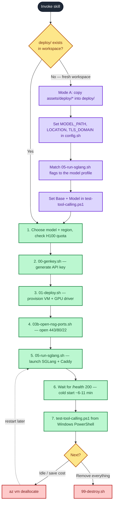

# Deploy SGLang on Azure H100

Provision and operate an OpenAI-compatible inference endpoint on a single **H100 NVL (94 GB)**
Azure VM. SGLang serves the model on loopback; Caddy terminates TLS and enforces an API key.

This skill works in **two modes**:

- **Mode A — Generate the code.** When the `deploy/` toolkit does not exist (a fresh workspace),
  scaffold it from the skill's bundled reference templates in [`./assets/deploy/`](./assets/deploy),
  then customize it for the chosen model and region.
- **Mode B — Operate the toolkit.** Run the scripts in order to provision, launch, test, and tear
  down the endpoint.

The bundled templates in [`./assets/deploy/`](./assets/deploy) are a faithful copy of this repo's
proven `deploy/` scripts — they are the **reference implementation** the skill generates from. The
single source of configuration is always `config.sh`.

## When to Use

- **Scaffold a new deployment** — generate the `deploy/` scripts into a workspace that doesn't have them.
- Deploy Qwen (or another HuggingFace model that fits 94 GB) as an OpenAI-compatible API.
- Swap the served model on an existing deployment (regenerate the launch flags for the new model).
- Re-launch after the VM was deallocated, or verify tool calling end-to-end.

## Workflow



> Legend — ⬛ start · 🟨 decision · 🟪 Mode A (generate) · 🟩 Mode B (operate) · 🟥 teardown.

## Prerequisites (check first)

1. **Azure CLI logged in**: `az account show`. If this is a corporate machine running
   **Global Secure Access (GSA)**, native Linux `az` inside WSL cannot log in — `config.sh`
   auto-bridges `az` to the Windows CLI via interop. Just `source ./config.sh` and it works.
2. **H100 quota** in the target region (NCadsH100v5 family). Verify before deploying — see Step 2.
3. **Tools**: `openssl` (key generation), Docker is installed on the VM by cloud-init (not locally).
4. **Terminal**: commands below are bash/WSL. Public-endpoint **testing must run from Windows
   PowerShell** — WSL is blocked by GSA (see [Gotchas](#gotchas-hard-won-lessons)).

## Mode A — Generate the deployment toolkit

Do this **only if `deploy/` does not already exist** in the workspace (or the user explicitly wants
a fresh copy). If `deploy/` is already present, skip to **Mode B**.

1. **Copy the templates** from [`./assets/deploy/`](./assets/deploy) into a `deploy/` folder at the
   workspace root — every file, including the dotfile `.gitignore`, `Caddyfile.tmpl`, and
   `cloud-init.yaml`. Keep filenames exactly (the scripts call each other by name).
2. **Set the model + region** in `deploy/config.sh`: `MODEL_PATH`, `LOCATION`, and `TLS_DOMAIN`
   (empty = self-signed cert; a DNS name you control = Let's Encrypt). The template ships with the
   workshop defaults (`Qwen/Qwen3.6-35B-A3B-FP8`, `indonesiacentral`, `openai.contoso.day`) — change
   `TLS_DOMAIN` to your own domain or leave it empty, since you won't own the example one.
3. **Match the launch flags to the model.** The template `deploy/05-run-sglang.sh` ships with
   **Profile A** (hybrid Qwen3.6-35B). For any other model family, rewrite the
   `python3 -m sglang.launch_server` flag block to the matching profile in the
   [model catalog](./references/model-catalog.md#flag-profiles) — drop the `--mamba-*` /
   `--speculative-*` flags and set the correct `--tool-call-parser` / `--reasoning-parser`.
4. **Update the test script** `deploy/test-tool-calling.ps1`: set `$Base` to your endpoint
   (`https://<domain-or-ip>`) and `$Model` to the exact served model id.
5. **Make the scripts executable** and confirm secrets stay out of git:
   `chmod +x deploy/*.sh`, and verify `deploy/.gitignore` lists `.secrets/`.

The generated `deploy/` folder is now ready — continue with Mode B.

## Mode B — Operate the deployment toolkit

Run everything from the `deploy/` directory: `cd deploy`. Each script sources `config.sh`.

### 1. Choose the model (must fit 94 GB)

Default is **`Qwen/Qwen3.6-35B-A3B-FP8`** (tool-capable, fits comfortably). To pick something
else, consult the [model catalog](./references/model-catalog.md) for vetted options, the VRAM
rule-of-thumb, and the **correct SGLang parser/launch flags per model family**. To validate a
model the user names that is *not* in the catalog, follow the
[custom-model validation](./references/model-catalog.md#validating-a-custom-model) procedure
(estimate weights VRAM, confirm it fits, pick the right `--tool-call-parser` / `--reasoning-parser`).

> ⚠️ The launch flags in [`deploy/05-run-sglang.sh`](../../../deploy/05-run-sglang.sh) are tuned
> for the **hybrid Qwen3.6-35B-A3B** model (Mamba2 + MoE + MTP). For a different model family you
> **must** adjust those flags (drop `--mamba-*`, `--speculative-*` / NEXTN, and set the right
> parsers). The catalog gives a flag profile for each model class.

### 2. Choose the region + confirm quota

Default **`indonesiacentral`**. If the user wants another region, ask which one, then verify the
H100 SKU is available there and that quota is free:

```bash
# Quota for the H100 family in the chosen region (look for NCadsH100v5):
az vm list-usage --location <region> \
  --query "[?contains(localName,'NCadsH100v5')].{name:localName, used:currentValue, limit:limit}" -o table
```

If the limit is 0, the user must request a quota increase before continuing. The 1-GPU SKU needs
**40 vCPUs**; the 2-GPU `Standard_NC80adis_H100_v5` needs 80.

### 3. Apply configuration

Set the model and region in [`deploy/config.sh`](../../../deploy/config.sh) (edit the file, or
export overrides for a one-off run). Keep all tunables in `config.sh` — never hardcode them in the
step scripts.

```bash
# Edit config.sh: MODEL_PATH, LOCATION (and TLS_DOMAIN/TLS_EMAIL if using a custom domain).
# Or override at runtime, e.g.:
export MODEL_PATH="Qwen/Qwen3.6-35B-A3B-FP8"
export LOCATION="indonesiacentral"
# If the model is gated on HuggingFace, also: export HF_TOKEN=hf_xxx
```

- `TLS_DOMAIN` empty → Caddy serves a **self-signed** cert (IP access, clients use `curl -k`).
- `TLS_DOMAIN` set + DNS A-record points at the public IP → **Let's Encrypt** trusted cert.

### 4. Generate the API key

```bash
bash 00-genkey.sh          # writes deploy/.secrets/api_key (git-ignored, mode 600); value never printed
# Rotate later with:  bash 00-genkey.sh --rotate   (then re-run step 7 to apply; only Caddy restarts)
```

### 5. Provision the VM (idempotent)

```bash
bash 01-deploy.sh          # RG, VNet/subnet, NSG, Static public IP, NIC, VM + cloud-init, NVIDIA driver ext
```

If the VM already exists this just starts it. Cloud-init (Docker + NVIDIA Container Toolkit) and the
GPU driver extension may still be finishing when the script returns.

### 6. Open the firewall (use the robust script)

```bash
bash 03b-open-nsg-ports.sh # specific per-port inbound rules: 443 HTTPS, 80 ACME, 22 SSH
```

**Use `03b`, not `03`.** Azure auto-remediation strips broad any-any rules, which silently breaks
the public endpoint. The specific per-port rules survive. Re-run this script any time the endpoint
becomes unreachable (`ERR_CONNECTION_CLOSED`). Verify with [`04-check-nsg.sh`](../../../deploy/04-check-nsg.sh).

### 7. Launch SGLang + Caddy

```bash
bash 05-run-sglang.sh      # pulls images, starts the model container (loopback) + Caddy (TLS + auth)
```

Runs remotely via `az vm run-command` (no SSH). The script then polls `/health` and reports READY.

### 8. Wait for readiness (cold start is normal)

First health-200 after a cold start takes **~6–11 minutes** even when weights are already cached —
this is **not** a download. The time is spent on: **loading weights disk→VRAM (~3–4 min)**,
**CUDA graph capture (~2 min)**, KV/Mamba cache init, and a warmup generation (SGLang returns `503`
until warmup completes). Watch progress with:

```bash
source ./config.sh
az vm run-command invoke -g "$RESOURCE_GROUP" -n "$VM_NAME" --command-id RunShellScript \
  --scripts 'docker logs --tail 30 sglang; curl -s -o /dev/null -w "health=%{http_code}\n" http://127.0.0.1:30000/health' \
  --query "value[0].message" -o tsv
```

### 9. Test end-to-end (from Windows PowerShell)

```powershell
# Windows PowerShell (NOT WSL — GSA blocks WSL from reaching the public endpoint):
pwsh -File .\deploy\test-tool-calling.ps1
```

[`test-tool-calling.ps1`](../../../deploy/test-tool-calling.ps1) reads the key from
`.secrets/api_key` and runs: **health → models → basic chat → tool calling**. A pass shows
`finish_reason: tool_calls` and the parsed `get_weather` call. If you changed the model, update
`$Model` in that script (or pass the new id) so it matches the served model id exactly.

Quick manual check (also from Windows, or on the VM via loopback):

```bash
curl -k https://<domain-or-ip>/v1/chat/completions \
  -H "Authorization: Bearer $API_KEY" -H 'Content-Type: application/json' \
  -d '{"model":"<MODEL_PATH>","messages":[{"role":"user","content":"Hello"}]}'
```

### 10. Cost control

The H100 VM is expensive (~$4+/hr). Stop compute billing when idle; weights stay cached on disk:

```bash
az vm deallocate -g sglang-rg -n sglang-h100   # stop billing
az vm start      -g sglang-rg -n sglang-h100   # later; then re-run step 7 (cold start applies)
```

### 11. Teardown

```bash
bash 99-destroy.sh         # deletes the resource group and everything in it
```

## Gotchas (hard-won lessons)

- **NSG rules vanish.** Azure auto-remediation removes broad inbound rules → endpoint dies with
  `ERR_CONNECTION_CLOSED`. Fix: re-run [`03b-open-nsg-ports.sh`](../../../deploy/03b-open-nsg-ports.sh)
  (specific per-port rules). Don't rely on `03-open-nsg.sh`'s broad rule.
- **WSL can't reach the public endpoint or `login.microsoftonline.com`** (GSA). Test from Windows
  PowerShell. `az` works in WSL only via the Windows-CLI bridge in `config.sh`.
- **SSH (port 22) is blocked by GSA** machine-wide (TCP connects, then the SSH handshake is closed) —
  confirmed from both WSL and Windows. Run commands on the VM with
  `az vm run-command invoke ... --command-id RunShellScript`, not SSH.
- **The VM can't reach its own public domain** (Azure hairpin NAT). On-VM tests must use
  `http://127.0.0.1:30000`; a run-command `curl` to the public HTTPS URL will time out — that's expected.
- **Cold start ≠ download.** "Waiting for the model to finish loading" is mostly weight-load +
  CUDA-graph capture, even when the HF snapshot is already cached. ~6–11 min is normal.
- **Tool calling needs the right parsers.** A base model with no tool training won't emit tool calls.
  For Qwen3.6 use `--reasoning-parser qwen3` and `--tool-call-parser qwen3_coder` (parser name is
  `qwen3_coder`, not `qwen`/`hermes`/`qwen25`). Other families need different parser names — see the catalog.
- **Never commit secrets.** `deploy/.secrets/` is git-ignored. Don't paste the API key into tracked
  files; reference it via `${input:...}` (VS Code) or `$API_KEY` (shell).

## References

- [Model catalog & VRAM sizing for H100 94 GB](./references/model-catalog.md)
- Bundled deploy templates — the reference implementation this skill generates from: [`./assets/deploy/`](./assets/deploy)
- Repo overview: [`README.md`](../../../README.md) · deploy details: [`deploy/README.md`](../../../deploy/README.md)
