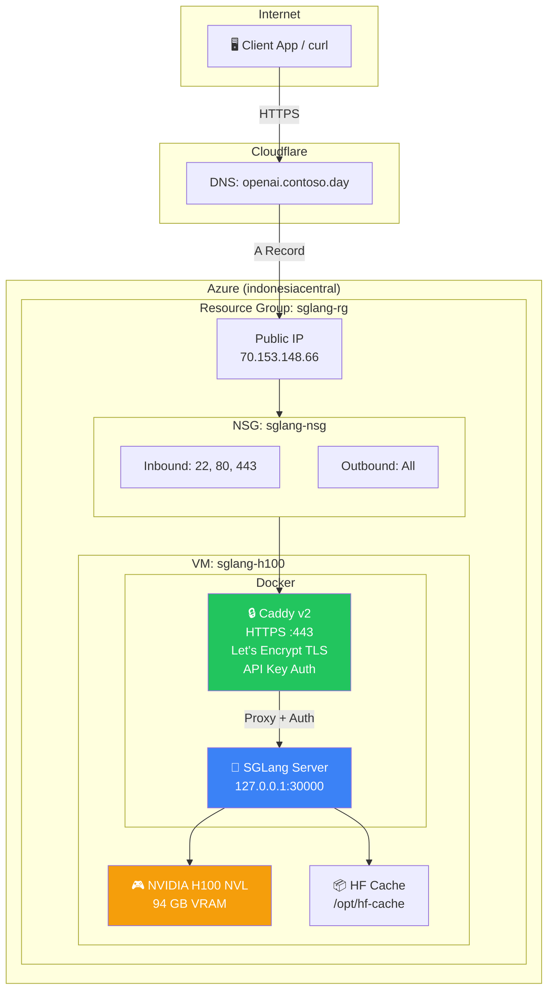
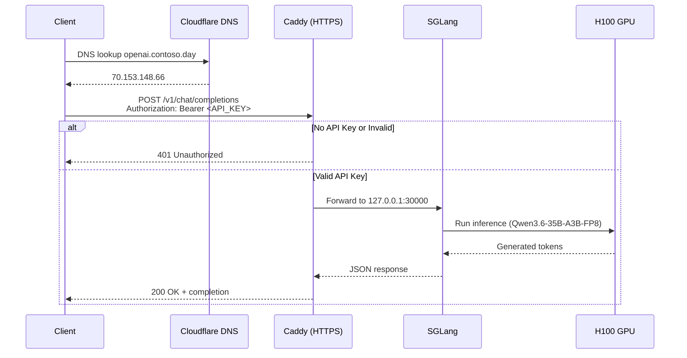
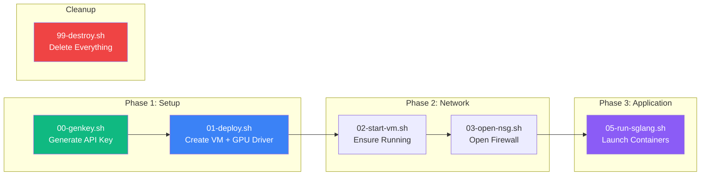

# SGLang on Azure H100 — OpenAI-Compatible Endpoint

Deploy **Qwen3.6-35B-A3B-FP8** (or any HuggingFace model) on Azure with a single H100 GPU, served via [SGLang](https://github.com/sgl-project/sglang) behind a Caddy HTTPS reverse-proxy with API-key authentication.

```
https://openai.contoso.day/v1/chat/completions
```

## Architecture



## Request Flow



## Deployment Scripts



## Quick Start

### Prerequisites

- Azure subscription with H100 quota in `indonesiacentral`
- Azure CLI (`az`) authenticated
- WSL2 (Ubuntu) or Linux
- A domain name (optional, for Let's Encrypt; falls back to self-signed cert for IP access)

### 1. Clone & Configure

```bash
git clone https://github.com/ibranibeny/sglang-azure-workshop.git
cd sglang-azure-workshop

# Edit deploy/config.sh to customize:
# - MODEL_PATH (default: Qwen/Qwen3.6-35B-A3B-FP8)
# - TLS_DOMAIN (your domain, or leave empty for IP-based access)
# - LOCATION (Azure region)
```

### 2. Deploy

```bash
cd deploy

# Generate API key (stored in .secrets/api_key)
bash 00-genkey.sh

# Create VM with H100 + NVIDIA driver
bash 01-deploy.sh

# Open firewall
bash 03-open-nsg.sh

# Launch SGLang + Caddy (downloads model, starts serving)
bash 05-run-sglang.sh
```

### 3. Test

```bash
export API_KEY=$(cat deploy/.secrets/api_key)

# Health check (no auth required)
curl https://openai.contoso.day/health

# Chat completion
curl https://openai.contoso.day/v1/chat/completions \
  -H "Authorization: Bearer $API_KEY" \
  -H 'Content-Type: application/json' \
  -d '{
    "model": "Qwen/Qwen3.6-35B-A3B-FP8",
    "messages": [{"role": "user", "content": "Hello!"}]
  }'

# List models
curl https://openai.contoso.day/v1/models \
  -H "Authorization: Bearer $API_KEY"
```

## Project Structure

```
.
├── deploy/
│   ├── config.sh           # All configuration (VM size, model, domain, etc.)
│   ├── 00-genkey.sh        # Generate 256-bit API key
│   ├── 01-deploy.sh        # Create RG, VNet, NSG, VM, install GPU driver
│   ├── 02-start-vm.sh      # Start/allocate VM
│   ├── 03-open-nsg.sh      # Open inbound/outbound ports
│   ├── 04-check-nsg.sh     # Verify NSG rules
│   ├── 05-run-sglang.sh    # Launch SGLang + Caddy containers
│   ├── 99-destroy.sh       # Delete all resources
│   ├── Caddyfile.tmpl      # Caddy config template
│   ├── cloud-init.yaml     # VM bootstrap (Docker install)
│   └── .secrets/           # API key (git-ignored)
├── specs/                  # Feature specifications
├── DEPLOYMENT_REPORT.md    # Detailed deployment status
└── README.md               # This file
```

## Configuration

Edit `deploy/config.sh`:

| Variable | Default | Description |
|----------|---------|-------------|
| `MODEL_PATH` | `Qwen/Qwen3.6-35B-A3B-FP8` | HuggingFace model ID |
| `VM_SIZE` | `Standard_NC40ads_H100_v5` | 1× H100 NVL (94GB) |
| `LOCATION` | `indonesiacentral` | Azure region |
| `TLS_DOMAIN` | `openai.contoso.day` | Domain for Let's Encrypt (empty = self-signed) |
| `TLS_EMAIL` | _(empty)_ | ACME contact email (optional) |
| `TP_SIZE` | `1` | Tensor parallelism (GPUs) |

## VM Sizes

| SKU | GPUs | VRAM | Use Case |
|-----|------|------|----------|
| `Standard_NC40ads_H100_v5` | 1× H100 NVL | 94 GB | Up to ~70B models |
| `Standard_NC80adis_H100_v5` | 2× H100 NVL | 188 GB | 70B+ models, `--tp 2` |

## Cost Management

The H100 VM is **expensive** (~$4+/hour). Stop billing when idle:

```bash
# Stop VM (keeps disk, stops compute billing)
az vm deallocate -g sglang-rg -n sglang-h100

# Restart later
az vm start -g sglang-rg -n sglang-h100
bash deploy/05-run-sglang.sh   # Re-launch containers

# Delete everything
bash deploy/99-destroy.sh
```

## Security Notes

- 🔒 SGLang binds to `127.0.0.1` only — not directly exposed
- 🔒 All traffic goes through Caddy with API-key authentication
- 🔒 TLS via Let's Encrypt (auto-renewed) or self-signed
- ⚠️ Default NSG opens all ports for testing — restrict in production

## Troubleshooting

### Connection timeout
```bash
# Check NSG rules
bash deploy/04-check-nsg.sh

# Re-open ports if missing
bash deploy/03-open-nsg.sh
```

### Model not loading
```bash
# SSH into VM
ssh azureuser@70.153.148.66

# Check SGLang logs
docker logs -f sglang

# Check GPU
nvidia-smi
```

### Caddy/TLS issues
```bash
# On the VM
docker logs --tail 100 caddy
```

## OpenAI SDK Compatibility

```python
from openai import OpenAI

client = OpenAI(
    base_url="https://openai.contoso.day/v1",
    api_key="your-api-key-here"
)

response = client.chat.completions.create(
    model="Qwen/Qwen3.6-35B-A3B-FP8",
    messages=[
        {"role": "system", "content": "You are a helpful assistant."},
        {"role": "user", "content": "What is the capital of France?"}
    ],
    max_tokens=100
)

print(response.choices[0].message.content)
```

## VS Code Copilot Integration

Use this endpoint as a custom model in **GitHub Copilot Chat** (Chat & Agent mode) by adding it to your VS Code `chatLanguageModels.json`.

### 1. Locate the config file

| OS | Path |
|----|------|
| Windows | `%APPDATA%\Code\User\chatLanguageModels.json` |
| macOS | `~/Library/Application Support/Code/User/chatLanguageModels.json` |
| Linux | `~/.config/Code/User/chatLanguageModels.json` |

> The file lives in the same `User` folder as `settings.json`. Create it if it doesn't exist.

### 2. Add the custom endpoint

```jsonc
[
  {
    "name": "Azure H100",
    "vendor": "customendpoint",
    "apiKey": "${input:chat.lm.secret.azure-h100}",
    "apiType": "chat-completions",
    "models": [
      {
        "id": "Qwen/Qwen3.6-35B-A3B-FP8",
        "name": "Qwen 3.6 35B FP8 (192K)",
        "url": "https://openai.contoso.day/v1/chat/completions",
        "toolCalling": true,
        "vision": false,
        "maxInputTokens": 131072,
        "maxOutputTokens": 65536
      }
    ]
  }
]
```

| Field | Value | Notes |
|-------|-------|-------|
| `vendor` | `customendpoint` | Required for any OpenAI-compatible server |
| `apiType` | `chat-completions` | Uses the `/v1/chat/completions` route |
| `apiKey` | `${input:...}` | VS Code prompts once and stores the key in the OS secret store. You can also paste the key inline (less secure). |
| `id` | `Qwen/Qwen3.6-35B-A3B-FP8` | Must match the model served by SGLang (`MODEL_PATH`) |
| `url` | `https://openai.contoso.day/v1/chat/completions` | Your Caddy HTTPS endpoint |
| `toolCalling` | `true` | Enables Agent-mode tool calls (`qwen3_coder` parser) |
| `maxInputTokens` | `131072` | 128K context window |
| `maxOutputTokens` | `65536` | Max generation length |

### 3. Select the model

1. Reload VS Code (**Developer: Reload Window**).
2. Open Copilot Chat → model picker → choose **Qwen 3.6 35B FP8 (192K)**.
3. On first use, paste your API key (`cat deploy/.secrets/api_key`) when prompted.

> ⚠️ Custom endpoints work in **Chat & Agent mode only** — not inline ghost-text completion.

## License

MIT

## Acknowledgments

- [SGLang](https://github.com/sgl-project/sglang) — Fast serving framework
- [Caddy](https://caddyserver.com/) — Automatic HTTPS server
- [Qwen](https://huggingface.co/Qwen) — Open-weight LLM family
